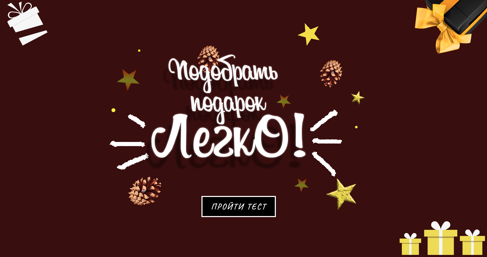
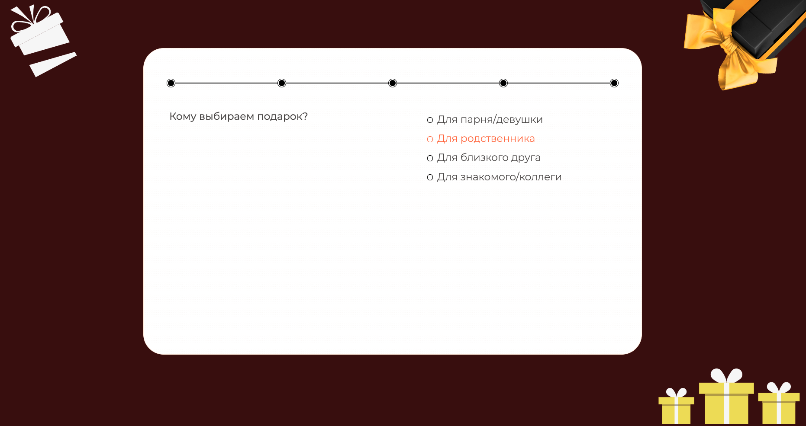
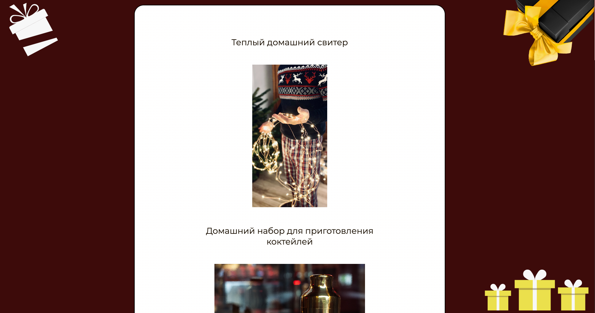

# About repository

This project - my first react-app. Purpose of this work in practice is to do full cycle of web-application development,
starting from creation UI/UX design to finally production build, deploy and documentation.

## Completed tasks

* Made a website layout in Figma, drew svg icons and favicon in Adobe Illustrator
* Developed web-app using react. Create architecture of project.  
  During development, I also used libraries such as: create-react-app, prop-types, react-lazy-load-image-component
* Components developed using React Hooks technology
* Compiled a database of questions and answers. Currently, app contains over 50 gift options
* Site is adapted for mobile devices

# Example

 

 

 

